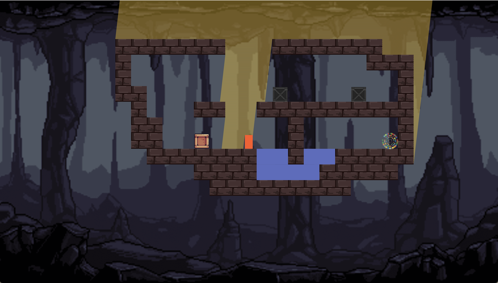
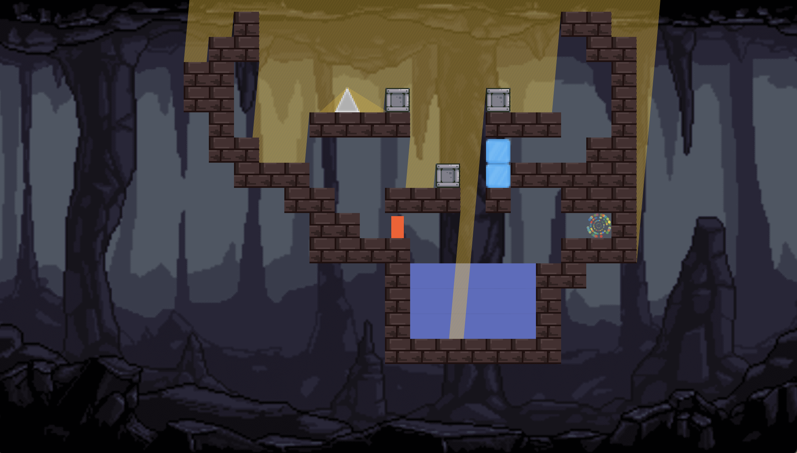

# Pixothermic

Made for the [Flame Jam 3.0](https://itch.io/jam/flame-jam-3) in 2 days.
By @alexobviously and @thebeville

Theme: hot and cold.
Limitation: no text. There is some text in the level editor but the game itself contains none.

## How to play

A and D to move. Space to jump. Get to the end portal through the use of heat.

## Screenshots

## Note on performance

This game has some fairly intense (and not super optimised) processing, and it's possible that you will get low frame rates on some levels with some setups. If this happens, you can try lowering the ray density (press the settings cog in game, and adjust the slider). Physics are a bit weird at low FPS for some reason.

## Level editor

There's a level editor - click the 'tools' icon at the top right on home. Currently no easy local storage, but you can copy it as JSON, and paste it back in as JSON.

## Resources

- Background music was made by us.
- Background image is: https://admurin.itch.io/parallax-backgrounds-caves
- Sprites in the game are from: https://szadiart.itch.io/pixel-fantasy-caves and https://www.gameart2d.com/winter-platformer-game-tileset.html
- You can also use some sprites from https://pixelfrog-assets.itch.io/pixel-adventure-1 in the level editor (original placeholders)